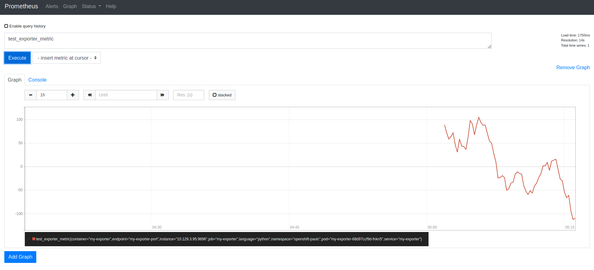

# exporter_sample
This repo provides a simple example which illustrates how to integrate a simple prometheus exporter with the Openshift Prometheus monitoring environment.

Each of the resources are provided in separate files to make it easier to see and understand the component relationships.

Use the following execution sequence

1. namespace
2. role
3. rolebinding
4. deployment
5. service
6. service-monitor

The sample exporter (```exporter.py``` is a simple python script which just generates a single metric called ```test_exporter_metric```. If all goes well(!), you should be able to create a chart in the prometheus UI with this metric...



